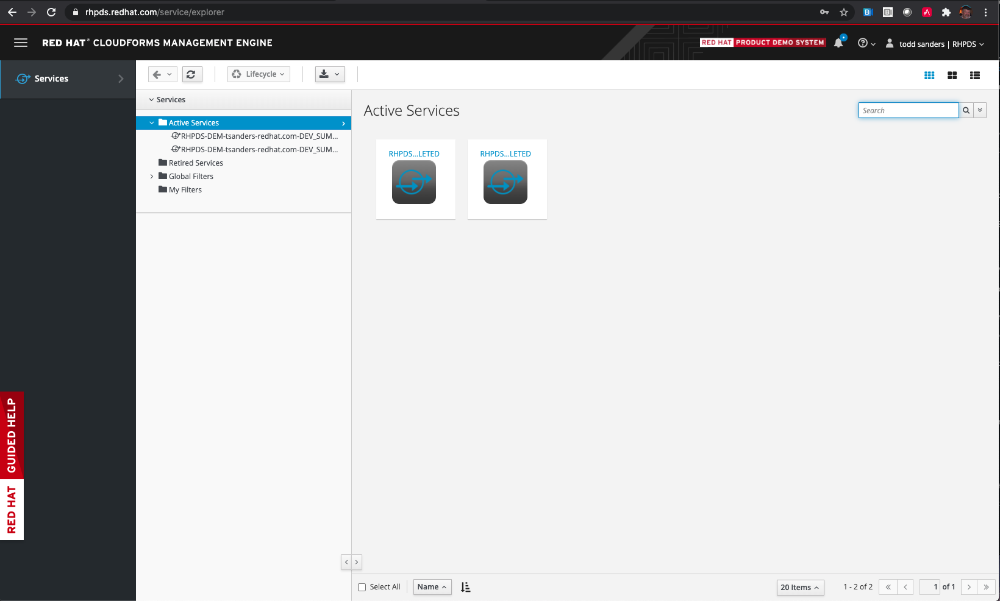
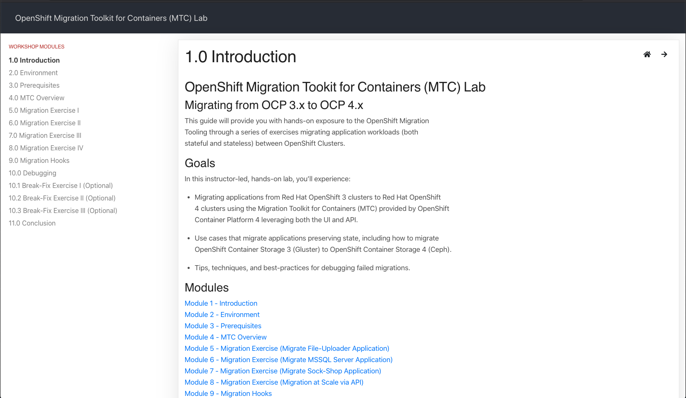

# OpenShift API for Data Protection (OADP) Lab

This guide will provide you with hands-on exposure to the new OpenShift API for Data Protection through a series of labs backup and restore workloads (both stateful and stateless) on the same OpenShift cluster.

## Description

Backup and restore application workloads  (includes ui, controller, Velero/Restic, plugins, etc). This application is available for installation through the Operator Hub/OLM. This course requires both the MTC OCP3 and OCP4 services from RHPDS.

## Goals

* Migrating applications from Red Hat OpenShift 3 clusters to Red Hat OpenShift
4 clusters using the Migration Toolkit for Containers (MTC) provided by OpenShift
Container Platform 4 leveraging both the UI and API.

* Use cases that migrate applications preserving state, including how to migrate
OpenShift Container Storage 3 (Gluster) to OpenShift Container Storage 4 (Ceph).

* Tips, techniques, and best-practices for debugging failed migrations.

## Setup Steps

Step 1: Browse to RHPDS: https://rhpds.redhat.com


Step 2: Login with your RHPDS username/password.

Step 3: Hover over Services Menu >> Click the Catalogs menu and open the “Openshift Workshop” catalog.

Step 4: Order two services as follows:

* Migration Toolkit for Containers (OCP3)
* Migration Toolkit for Containers (OCP4)

Step 5: Wait for both services to become available.  ```This will take ~60 min.```. When the environment has finished provisioning you will receive an email with confirmation and access details for the labs.



Step 6: Open a terminal window. You will use this to SSH into your OCP4 cluster. SSH into the OCP4 bastion host using the information provided in RHPDS for the provisioned service.

```bash
$ ssh tsanders-redhat.com@bastion.clayton-a831.example.opentlc.com
The authenticity of host 'bastion.clayton-a831.example.opentlc.com (54.196.40.213)' can't be established.
ECDSA key fingerprint is SHA256:GmGLppSGEshB6jBVODuMnAQrZhOVUTnflNZV4WIfn+E.
Are you sure you want to continue connecting (yes/no/[fingerprint])? yes
Warning: Permanently added 'bastion.clayton-a831.example.opentlc.com,54.196.40.213' (ECDSA) to the list of known hosts.
tsanders-redhat.com@bastion.clayton-a831.example.opentlc.com's password:
```

As soon as you log in, you will be greeted by a "Welcome to MTC LAB" screen. This will ask you to provide the bastion hostname of the OCP3 cluster for your lab. This will be the first Master of your OCP3. You can find this information in the email you received after your OCP3 cluster was provisioned. Paste the whole hostname of OCP3 bastion host into the terminal.
It will look something like:

```
Please enter your OCP3 bastion hostname.
That is the one you received FOR YOUR OCP3 environment: master1.fp62b.sandbox1012.opentlc.com
```

Step 7: After entering the bastion hostname, press enter, sit back and relax while the scripts provision Bookbag instruction pages for you. Be patient while the script configures and deploys the necessary pods. The process takes around 2 minutes.
When the script finishes, it will present you with a web page address which will lead you through the rest of the lab, and it will look similar to this:

```

                Your Bookbag is up and running.
                    You can reach it via:

         https://bookbag-lab-instructions.apps.cluster-a6c4.a6c4.sandbox1878.opentlc.com

```


Step 8: Make a note of the Bookbag address. This is where your lab instructions will be accessible at. Launch the auto-generated bookbag documentation by going to the supplied address in your web browser. You may need to accept self-signed certificates. When loaded Lab Instructions page will look like this:



Step 9. Proceed with Lab by following steps outlined in bookbag documentation.
