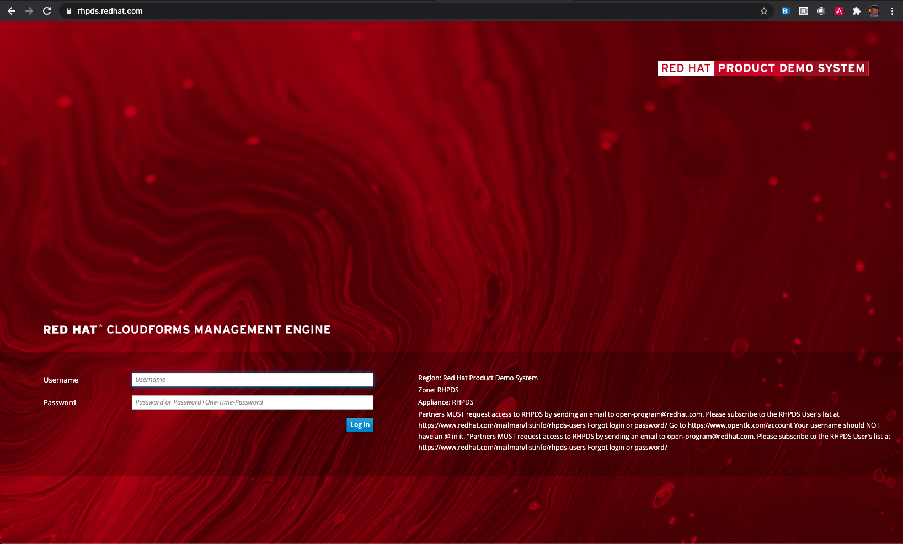

# OpenShift API for Data Protection (OADP) Lab

This guide will provide you with hands-on exposure to the new OpenShift API for Data Protection through a series of labs backup and restore workloads (both stateful and stateless) on the same OpenShift cluster.

## Description

Backup and restore stateless and stateful application workloads. This application is available for installation through the Operator Hub/OLM. This course requires OCP4 services from [RHPDS](http://rhpds.redhat.com/).

## Goals

* Backup and restore applications on OpenShift 4 clusters using the OpenShift API for Data Protection (OADP)) provided by OpenShift
Container Platform 4 leveraging both the UI and API.

* Tips, techniques, and best-practices for debugging failed backups/restores.

## Setup Steps

Step 1: Browse to RHPDS: https://rhpds.redhat.com



Step 2: Login with your RHPDS username/password.

Step 3: Hover over Services Menu >> Click the Catalogs menu and open the “Openshift Workshop” catalog.

<!-- TODO Create AgnosticD role for OADP -->
Step 4: Order OpenShift API for Data Protection

Step 5: Wait for both services to become available.  ```This will take ~60 min.```. When the environment has finished provisioning you will receive an email with confirmation and access details for the labs.
<!-- TODO replace this image -->


Step 6. Proceed with Lab by following steps outlined in bookbag documentation.
